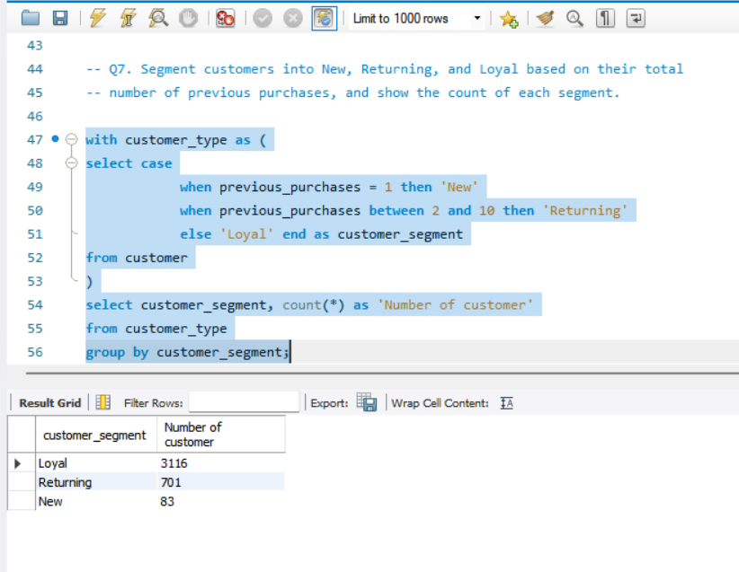
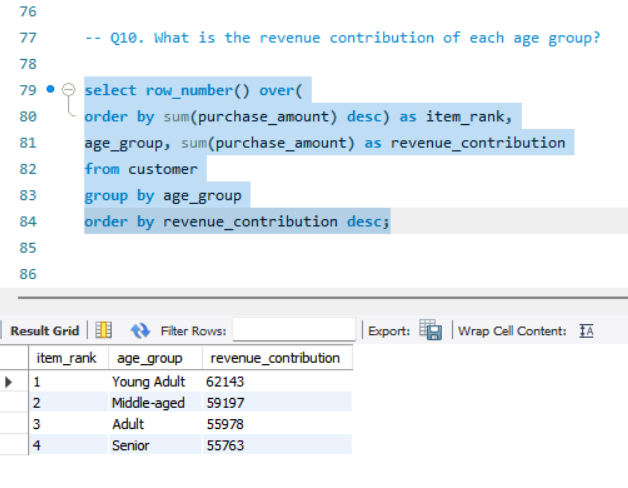
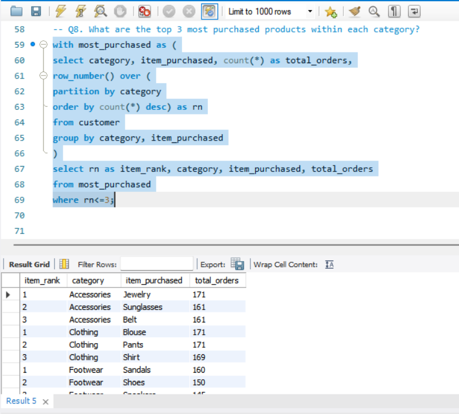
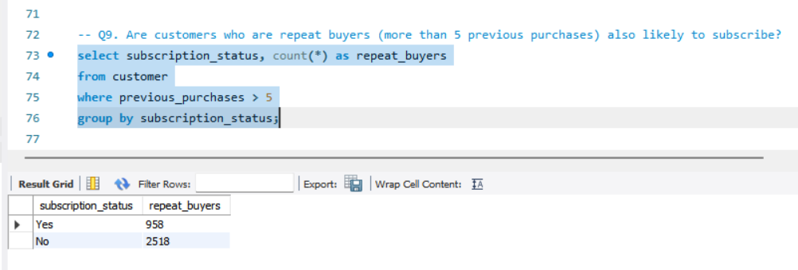

# 📊 Customer Behavior & Revenue Analytics

## About the Project

This project analyzes customer purchasing behavior, revenue trends, subscription patterns, and demographic insights using Python, MySQL, and Power BI.

The project follows an end-to-end analytics workflow, beginning with data cleaning and transformation in Python, followed by SQL-based analysis and interactive dashboard development in Power BI.

Using a dataset containing 3,900+ customer records, the project generates actionable business insights related to customer segments, spending behavior, subscriptions, and revenue performance.

---

## Project Objectives

* Analyze customer purchasing behavior
* Understand revenue trends across customer segments
* Evaluate subscription performance
* Identify high-value customer groups
* Perform demographic analysis using age and gender
* Build an interactive dashboard for business decision-making

---

## Tools & Technologies

### Python

* Pandas
* NumPy

### Database

* MySQL

### Visualization

* Power BI

---

## SQL Concepts Used

- Aggregate Functions
- GROUP BY & HAVING
- Subqueries
- Common Table Expressions (CTEs)
- Window Functions
- ROW_NUMBER()
- CASE Statements
- Customer Segmentation
- Business Analytics Queries

---

## Project Workflow

### 1. Data Cleaning & Transformation (Python)

- Handled missing values using category-wise median imputation
- Performed data preprocessing and validation
- Created age-group segments through feature engineering
- Exported cleaned data to MySQL for analysis

### 2. Data Analysis (MySQL)

- Revenue Analysis by Gender
- Customer Segmentation (New, Returning, Loyal)
- Subscription Analysis
- Discount Impact Analysis
- Product Rating Analysis
- Shipping Type Analysis
- Product Performance Analysis using CTEs and Window Functions

### 3. Dashboard Development (Power BI)

Built an interactive dashboard featuring:

- Total Customers
- Average Purchase Amount
- Average Review Rating
- Subscription Status Distribution
- Revenue by Category
- Sales by Category
- Revenue by Age Group
- Sales by Age Group

---

## Key Insights

* Identified customer segments contributing significantly to revenue.
* Analyzed purchasing behavior across age groups and genders.
* Evaluated subscription adoption patterns.
* Compared revenue contribution across product categories.
* Generated insights to support customer retention and revenue growth strategies.

---

## Repository Structure

📁 Dataset

📁 Insights

📁 Power BI Dashboard

📁 Python

📁 SQL Queries

📁 Screenshots

📄 README.md

---

## Sample Analysis Outputs

### Customer Segmentation Analysis

### Revenue Analysis

### Top Products by Category

### Subscription Analysis

---

## Author

Naman Tripathi

B.Tech, Materials & Metallurgical Engineering

MANIT Bhopal

